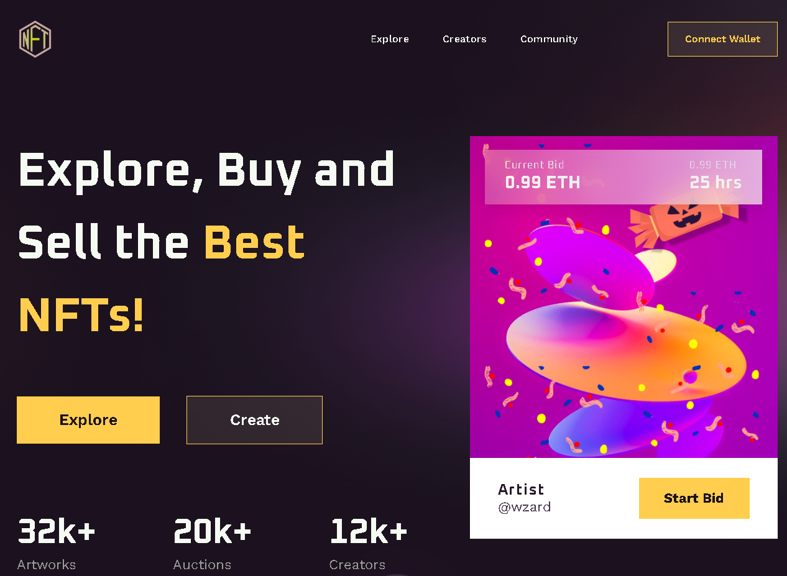
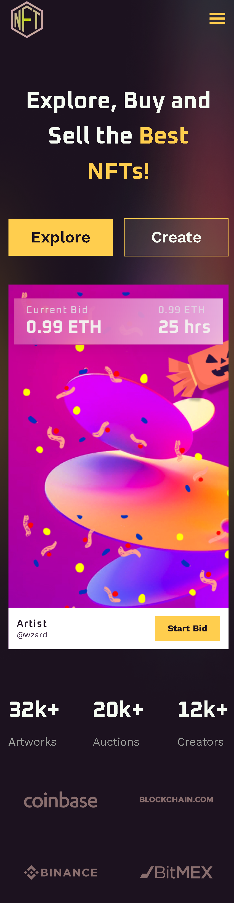

# NFT-Landing (html, scss, gulp, js)

NFT-landing based on html, scss, js and gulp.

## Screenshots

<p width="100%">


</p>

## Project installation

1. Installation & launch (Terminal 1):
```
npm i
npm run dev
```
2. Create svg sprites (Terminal 2):
```
npm run svgSprive
```
